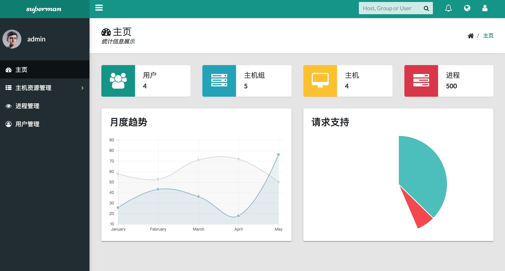
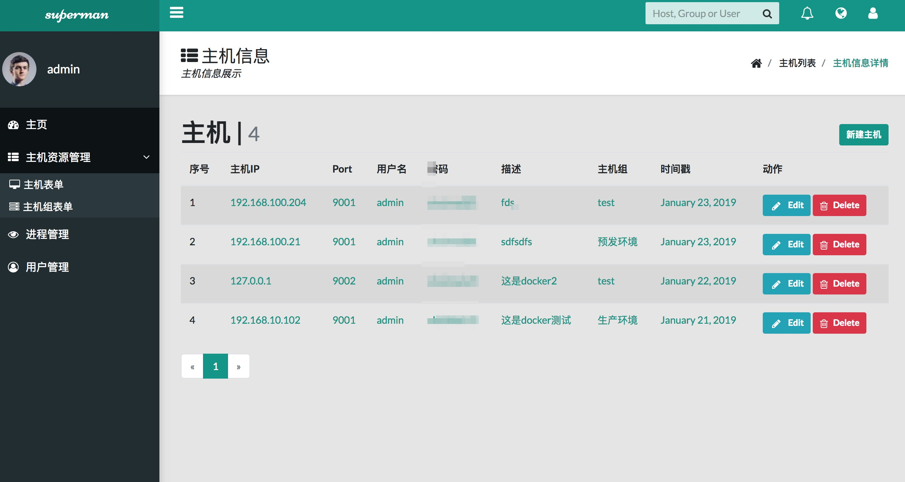
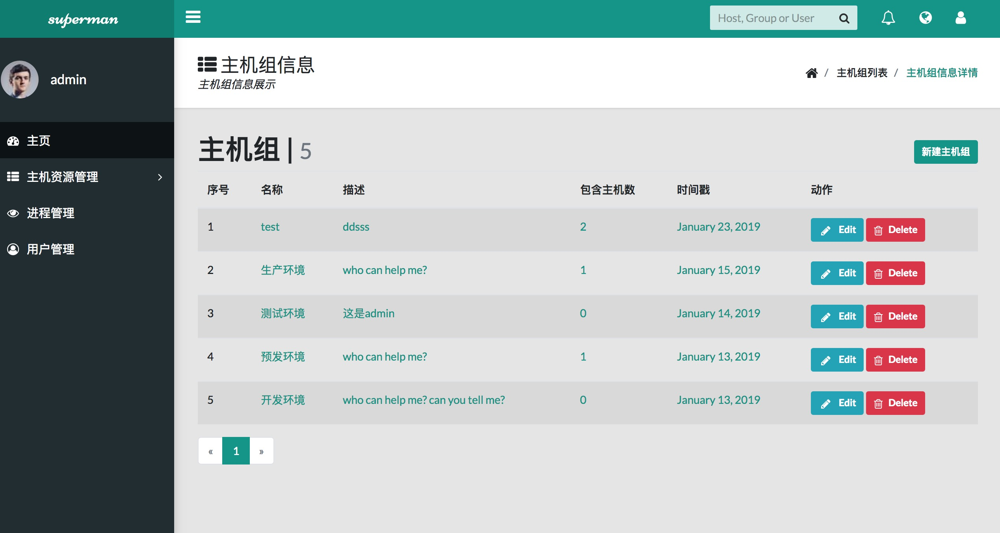
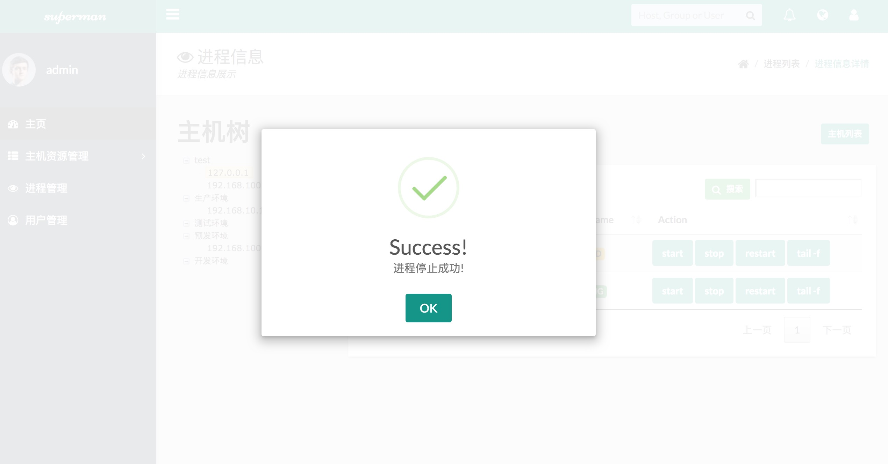
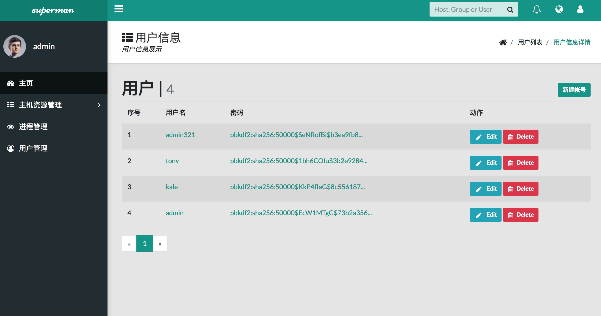

superman
=============


[TOC]

[](https://www.python.org/)
[](http://flask.pocoo.org/)
[](https://docs.pipenv.org/)


### 一、Installation

```python
$ git clone https://github.com/zhuima/superman.git
$ cd superman
$ pipenv install --dev
$ pipenv shell
$ flask forge
$ flask run
* Running on http://127.0.0.1:5000/login
* account: admin password: zhuima321

```


### 二、关于项目

- 后台管理使用: https://github.com/pratikborsadiya/vali-admin
- 练手，写(抄)了李辉大大的相关项目: https://github.com/greyli/bluelog
- 自助，自助，自助


三、DEMO

- index



- host



- hostgroup



- stopprecess




- tree


- user




### 四、TODO

- [ ] 登陆页面整合
- [ ] 国际化处理完全
- [ ] 安全相关
- [ ] 后台优化扩展
- [ ] 时间处理优化
- [ ] 代码优化


